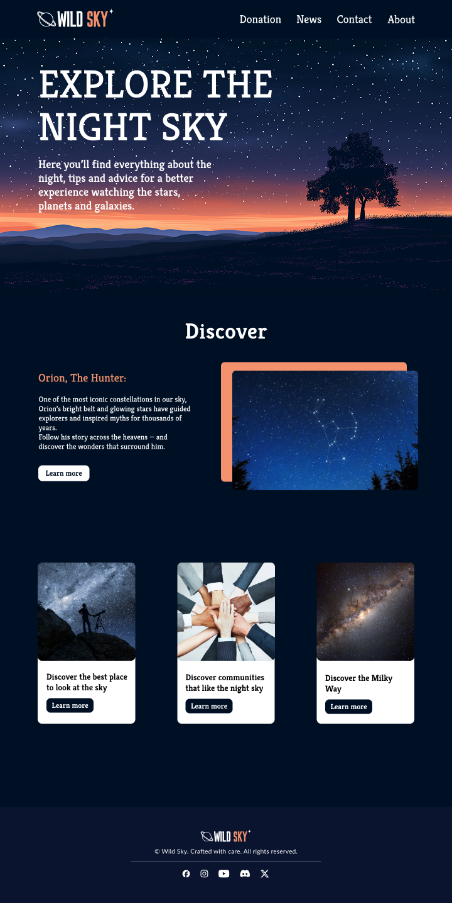
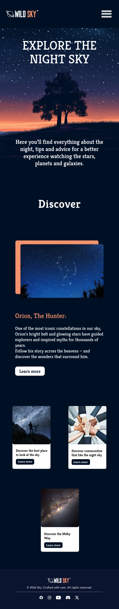

# NightSky

NightSky is a single-page portfolio project that introduces users to the beauty of the night sky. It offers tips, facts, and advice on stargazing and constellations. This is a sample homepage only — most links and buttons are static and do not lead to other pages.

## Website link:
https://wild-sky-website.vercel.app/

## Features

- Responsive design
- Informational layout on stargazing
- Smooth user interface elements
- Custom header, call-to-action sections, and visual content

> Note: This is a mock site for learning and portfolio purposes.

## Technologies

- HTML
- CSS
- JavaScript

## 🖼️ Wild Sky Preview

### 💻 Desktop Version

### 📱 Mobile Version

---

Feel free to clone or fork this repository for learning or inspiration.
